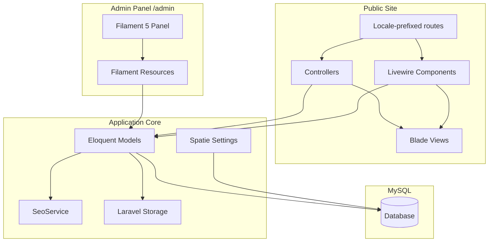
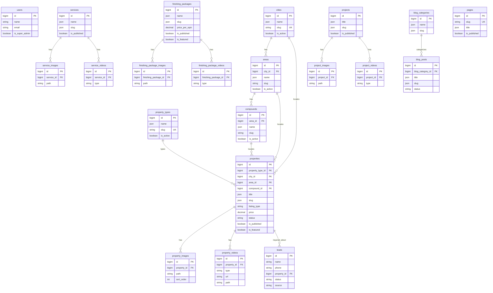

# Egyptra — Architecture Document

> **Version:** 1.0  
> **Last updated:** 2026-08-30  
> **Status:** Phase 1 (Architecture) — foundation scaffolded; feature implementation in progress

---

## Table of Contents

1. [Overview](#1-overview)
2. [Package Justifications](#2-package-justifications)
3. [Entity Relationship Diagram](#3-entity-relationship-diagram)
4. [Route Registry](#4-route-registry)
5. [Filament Admin Structure](#5-filament-admin-structure)
6. [Multilingual Strategy](#6-multilingual-strategy)
7. [SEO Architecture](#7-seo-architecture)
8. [Database Table Summaries](#8-database-table-summaries)
9. [Directory Structure](#9-directory-structure)
10. [Phase Implementation Checklist](#10-phase-implementation-checklist)
11. [Deployment Overview](#11-deployment-overview)
12. [Assumptions](#12-assumptions)

---

## 1. Overview

**Egyptra** is a multilingual real estate and finishing-services platform. The public website showcases properties, services, finishing packages, completed projects, and a blog. A Filament-powered admin panel lets a non-technical administrator manage all content without touching code.

### Architecture Pattern

Single **Laravel monolith** — no separate frontend app, no API layer, no microservices.

```
┌─────────────────────────────────────────────────────────────┐
│                     Egyptra (Laravel 13)                    │
├──────────────────────────┬──────────────────────────────────┤
│      Public Website      │         Admin Panel              │
│  Blade + Livewire 4      │         Filament 5               │
│  Tailwind CSS 4          │    (Livewire under the hood)     │
│  Alpine.js (minimal)     │                                  │
├──────────────────────────┴──────────────────────────────────┤
│  Eloquent ORM  │  Spatie Settings  │  Laravel Storage       │
├────────────────┴───────────────────┴────────────────────────┤
│                         MySQL 8                             │
└─────────────────────────────────────────────────────────────┘
```

### Technology Stack

| Layer | Technology | Version |
|---|---|---|
| Language | PHP | 8.3+ |
| Framework | Laravel | 13.x |
| Admin panel | Filament | 5.x |
| Reactive UI | Livewire | 4.x (via Filament + property filters) |
| Database | MySQL | 8.x |
| CSS | Tailwind CSS | 4.x |
| JS (minimal) | Alpine.js | Bundled with Livewire |
| Asset bundler | Vite | 8.x |
| Image processing | Intervention Image | 4.x |

### Design Principles

- **Simple first, extensible when necessary** — prefer Laravel conventions over custom abstractions.
- **Model → Controller / Livewire / Filament Resource** — extract a service class only when logic is genuinely shared.
- **Data-driven content** — property types, locations, packages, and services are admin-managed, never hard-coded.
- **SEO-first** — metadata, sitemaps, hreflang, and structured data are built in from the start.
- **Admin usability** — large labels, logical sections, helpful empty states, no technical jargon.

### High-Level Request Flow



---

## 2. Package Justifications

Every third-party dependency must earn its place. Packages not listed here are intentionally excluded from V1.

| Package | Purpose | Why This Package |
|---|---|---|
| `laravel/framework` ^13.17 | Application framework | Required stack; provides routing, ORM, auth, mail, validation, and storage. |
| `filament/filament` ~5.0 | Admin dashboard | Required stack; provides CRUD resources, forms, tables, media repeaters, and bilingual UI hooks without building a custom admin. |
| `livewire/livewire` v4.x | Reactive components | Required by Filament; also powers public property search/filter UI with query-string sync. |
| `spatie/laravel-translatable` ^6.14 | Multilingual content | Stores EN/AR/RU translations in JSON columns on a single row — avoids per-language tables while staying readable to any Laravel developer. |
| `spatie/laravel-sluggable` ^4.0 | Slug generation | Auto-generates URL slugs from titles per locale; supports manual override in admin forms. |
| `spatie/laravel-sitemap` ^8.2 | XML sitemap | Generates `/sitemap.xml` with all published localized URLs for search engines. |
| `spatie/laravel-settings` ^3.9 | Site settings | Typed, cacheable settings (site name, logo, WhatsApp, default SEO) editable from Filament without env changes. |
| `intervention/image-laravel` ^4.1 | Image optimization | Converts uploads to WebP with thumbnails on save — no heavy media library needed for V1. |
| `tailwindcss` ^4.0 | Public CSS | Required stack; utility-first styling for responsive public pages. |
| `@tailwindcss/vite` ^4.0 | Tailwind + Vite integration | Official Tailwind 4 Vite plugin. |
| `laravel-vite-plugin` ^3.1 | Asset pipeline | Standard Laravel + Vite integration. |

### Intentionally Excluded (V1)

| Skipped | Reason |
|---|---|
| Spatie Media Library | Custom `*_images` / `*_videos` tables are sufficient and simpler. |
| Meilisearch / Elasticsearch | MySQL `WHERE` + indexes handle property filtering at expected scale. |
| Redis / Horizon | No queue volume or caching requirement yet; `sync` queue driver is fine. |
| React / Vue / Inertia / Next.js | Violates monolith architecture; Blade + Livewire covers all needs. |
| Docker | VPS deployment is manual; Docker not required. |
| CRM / payment packages | Out of V1 scope. |

---

## 3. Entity Relationship Diagram

Core entities and their relationships. Location hierarchy is optional at each level — a property requires a city but area and compound are nullable.



### Location Validation Rules

- `city_id` is **required** on every property.
- `area_id` is optional; if set, must belong to the selected city.
- `compound_id` is optional; if set, must belong to the selected area.
- Admin UX uses dependent dropdowns: City → Area → Compound.

---

## 4. Route Registry

All public routes are prefixed with `{locale}` where locale is `en`, `ar`, or `ru`. The root URL `/` redirects to `/en` (default locale). Admin routes live at `/admin` with no locale prefix.

### Global Routes (no locale prefix)

| Method | Path | Name | Handler | Notes |
|---|---|---|---|---|
| GET | `/` | — | Redirect | Redirects to `/en` |
| GET | `/sitemap.xml` | `sitemap` | SitemapController | Generated via `spatie/laravel-sitemap` |
| GET | `/robots.txt` | `robots` | Closure or static | References sitemap URL |
| GET | `/up` | — | Laravel health | Framework health check |

### Admin Routes (Filament panel)

| Method | Path | Name | Handler | Notes |
|---|---|---|---|---|
| GET | `/admin` | `filament.admin.pages.dashboard` | Filament Dashboard | Requires auth |
| GET | `/admin/login` | `filament.admin.auth.login` | Filament Login | Guest only |
| POST | `/admin/logout` | `filament.admin.auth.logout` | Filament Logout | Authenticated |
| * | `/admin/*` | `filament.admin.*` | Filament Resources | Auto-discovered CRUD routes |

### Public Routes (locale-prefixed: `/{locale}/...`)

Route group middleware: `web`, `SetLocale`, `RedirectToLocale`.

| Method | Path | Route Name | Handler | Description |
|---|---|---|---|---|
| GET | `/{locale}` | `home` | `HomeController@index` | Homepage |
| GET | `/{locale}/properties` | `properties.index` | `Livewire\PropertyListing` | Property listing with filters |
| GET | `/{locale}/properties/{property:slug}` | `properties.show` | `PropertyController@show` | Property detail page |
| GET | `/{locale}/services` | `services.index` | `ServiceController@index` | Services listing |
| GET | `/{locale}/services/{service:slug}` | `services.show` | `ServiceController@show` | Service detail page |
| GET | `/{locale}/finishing-packages` | `packages.index` | `FinishingPackageController@index` | Finishing packages listing |
| GET | `/{locale}/finishing-packages/{package:slug}` | `packages.show` | `FinishingPackageController@show` | Package detail page |
| GET | `/{locale}/projects` | `projects.index` | `ProjectController@index` | Completed projects listing |
| GET | `/{locale}/projects/{project:slug}` | `projects.show` | `ProjectController@show` | Project detail page |
| GET | `/{locale}/blog` | `blog.index` | `BlogController@index` | Blog listing |
| GET | `/{locale}/blog/{post:slug}` | `blog.show` | `BlogController@show` | Blog article page |
| GET | `/{locale}/about` | `about` | `PageController@show` | About Us (from `pages` table, slug `about`) |
| GET | `/{locale}/contact` | `contact` | `ContactController@index` | Contact page with form |
| POST | `/{locale}/contact` | `contact.store` | `ContactController@store` | Submit contact form → create Lead |
| GET | `/{locale}/favorites` | `favorites` | `FavoriteController@index` | Client-side favorites page (optional) |

### Example Localized URLs

```
/en/properties
/en/properties/luxury-villa-new-cairo
/ar/properties/فيلا-فاخرة-القاهرة-الجديدة
/ru/properties/roskoshnaya-villa-novyj-kair
/en/finishing-packages/premium-finishing
/en/blog/market-update-2026
/en/contact
```

### Route Model Binding

Translatable entities resolve by locale-aware slug via the `HasTranslatableSlug` trait:

- Looks up slug in current locale JSON key first.
- Falls back to English slug if locale slug is missing.
- Only resolves published records (`is_published = true`).

---

## 5. Filament Admin Structure

**Panel path:** `/admin`  
**Panel ID:** `admin`  
**Provider:** `App\Providers\Filament\AdminPanelProvider`  
**Discovery:** Resources auto-discovered from `app/Filament/Resources/`

### Navigation Structure

```
Dashboard
│
├── Properties                    PropertyResource
├── Property Types                PropertyTypeResource
├── Locations                     LocationResource (or grouped City/Area/Compound resources)
│
├── Services                      ServiceResource
├── Finishing Packages            FinishingPackageResource
│
├── Projects                      ProjectResource
│
├── Blog                          BlogPostResource
│   └── Categories                BlogCategoryResource (sub-navigation)
│
├── Leads                         LeadResource
│
└── Settings                      SettingsPage (GeneralSettings + SeoSettings)
```

### Filament Resource List

| Resource | Model | Key Features |
|---|---|---|
| `PropertyResource` | `Property` | Translatable tabs (EN/AR/RU), dependent location dropdowns, image/video repeaters with reorder, SEO section, publish toggle, featured flag |
| `PropertyTypeResource` | `PropertyType` | Simple name + slug + active toggle + sort order |
| `CityResource` | `City` | Translatable name, slug, sort order, active toggle |
| `AreaResource` | `Area` | Belongs to city, translatable name, slug scoped to city |
| `CompoundResource` | `Compound` | Belongs to area, translatable name, slug scoped to area |
| `ServiceResource` | `Service` | Translatable content, media, publish toggle, sort order |
| `FinishingPackageResource` | `FinishingPackage` | Translatable content, price per sqm, media, featured flag |
| `ProjectResource` | `Project` | Translatable content, completion date, media, publish toggle |
| `BlogPostResource` | `BlogPost` | RichEditor content, category select, draft/published status, SEO |
| `BlogCategoryResource` | `BlogCategory` | Translatable name + slug |
| `LeadResource` | `Lead` | Read-only create (public form only), status dropdown, property relation, nav badge for new leads |
| `PageResource` | `Page` | Static pages (About, etc.), translatable content + SEO |

### Custom Filament Pages

| Page | Purpose |
|---|---|
| `Dashboard` | Stat widgets: total properties, available properties, packages count, new leads count; recent leads table |
| `SettingsPage` | General settings (site name, logo, contact, social) + SEO defaults in grouped sections |

### Dashboard Widgets

| Widget | Data |
|---|---|
| `PropertiesOverviewWidget` | Total properties / available count |
| `FinishingPackagesWidget` | Published packages count |
| `NewLeadsWidget` | Count of leads with status `new` |
| `RecentLeadsWidget` | Last 5 leads with name, phone, date, status |

### Form Organization Example (Property)

Filament form sections — human-friendly labels, no jargon:

1. **Property Information** — Title (language tabs), Property Type, Sale/Rent, Price, Currency, Status
2. **Property Details** — Area (sqm), Bedrooms, Bathrooms, Floor, Furnished
3. **Location** — City → Area → Compound (dependent), Google Maps URL
4. **Description** — Description (rich text), Features (repeater)
5. **Media** — Images (upload, reorder, preview, delete), Videos (URL or file upload)
6. **Visibility** — Featured toggle, Publish toggle
7. **Search Engine Settings** — Search Engine Title, Search Engine Description, Social Media Image

### Admin UX Rules

- Confirmation modal before all destructive actions.
- Helpful empty states with primary action buttons ("Add your first property").
- Large, readable labels; no exposure of IDs, JSON, or storage paths.
- Navigation badge on Leads when new inquiries exist.

---

## 6. Multilingual Strategy

### Locale Configuration

Defined in `App\Support\Locale`:

| Context | Locales | Default |
|---|---|---|
| Public website | `en`, `ar`, `ru` | `en` |
| Admin UI | `en`, `ar` | `en` |

```php
// App\Support\Locale
public const DEFAULT = 'en';
public const PUBLIC  = ['en', 'ar', 'ru'];
public const ADMIN   = ['en', 'ar'];
```

### Content Translation (Public)

**Strategy:** Spatie Translatable JSON columns — one database row per entity, translations stored as JSON.

Translatable fields per entity type:

| Entity | Translatable Fields |
|---|---|
| Property | `title`, `slug`, `description`, `features`, `seo_title`, `seo_description` |
| Property Type | `name` |
| City / Area / Compound | `name` |
| Service | `name`, `slug`, `description`, `features`, `price_info`, `seo_title`, `seo_description` |
| Finishing Package | `name`, `slug`, `description`, `features`, `seo_title`, `seo_description` |
| Project | `title`, `slug`, `description`, `location`, `features`, `seo_title`, `seo_description` |
| Blog Post | `title`, `slug`, `content`, `seo_title`, `seo_description` |
| Blog Category | `name`, `slug` |
| Page | `title`, `content`, `seo_title`, `seo_description` |
| Property Image | `alt` (optional) |

### URL Structure

```
/{locale}/{section}/{slug}

/en/properties/luxury-villa-new-cairo
/ar/properties/فيلا-فاخرة-القاهرة-الجديدة
/ru/services/otdelka-kvartir
```

Slugs may differ per locale. Auto-generated from title via `spatie/laravel-sluggable` with manual override in admin.

### RTL Support (Arabic)

- When `locale === 'ar'`: `<html dir="rtl" lang="ar">`
- Tailwind logical properties (`ms-`, `me-`, `ps-`, `pe-`) preferred over directional (`ml-`, `mr-`)
- Filament admin panel: `->direction('rtl')` when admin locale is Arabic
- Helper: `Locale::isRtl()` and `Locale::direction()`

### Admin Content Editing

- Filament **Tabs** per resource: English | العربية | Русский
- Admin sees which language they are editing at all times
- Slug uniqueness validated per locale

### Admin UI Localization (EN/AR)

- Filament locale switcher in top bar
- Translation files: `lang/en/filament.php`, `lang/ar/filament.php`
- Covers: navigation labels, section headings, empty states, validation messages, button text
- Russian is **content-only** — admin UI is not translated to Russian

### Middleware

| Middleware | Purpose |
|---|---|
| `SetLocale` | Reads `{locale}` route parameter, validates against `Locale::PUBLIC`, sets `app()->setLocale()` |
| `RedirectToLocale` | Redirects bare paths to default locale; handles invalid locale codes |

---

## 7. SEO Architecture

SEO is a first-class requirement, not a future feature. Every indexable public page outputs complete metadata.

### Components

| Component | Location | Role |
|---|---|---|
| `SeoService` | `app/Services/SeoService.php` | Resolves title, description, OG image with fallbacks |
| `HasSeo` trait | `app/Support/Concerns/HasSeo.php` | Model convenience methods: `seoTitle()`, `seoDescription()`, `ogImageUrl()` |
| `seo-meta` Blade component | `resources/views/components/seo-meta.blade.php` | Renders all `<head>` SEO tags |
| `json-ld` Blade component | `resources/views/components/json-ld.blade.php` | Renders structured data `<script>` blocks |

### Metadata Resolution

| Output | Priority Chain |
|---|---|
| `<title>` | Entity `seo_title` → `{title \| site_name}` → `SeoSettings.default_title` → `GeneralSettings.site_name` |
| `<meta name="description">` | Entity `seo_description` → truncated `description`/`content` (160 chars) → `SeoSettings.default_description` |
| `<link rel="canonical">` | Current fully-qualified localized URL |
| Open Graph (`og:title`, `og:description`, `og:image`, `og:url`, `og:locale`) | Same as above + entity `og_image` → `featured_image` → `SeoSettings.default_og_image` |
| hreflang `<link>` tags | All locale variants of the current page (`en`, `ar`, `ru`) + `x-default` pointing to English |

### Structured Data (JSON-LD)

Applied sparingly — only where schema.org types are valid:

| Page Type | Schema | Key Properties |
|---|---|---|
| Property detail | `RealEstateListing` | name, description, price, address, geo, image |
| Blog article | `Article` | headline, author, datePublished, image |
| Homepage / Contact | `Organization` | name, url, logo, contactPoint, sameAs (social links) |

### Sitemap

- Package: `spatie/laravel-sitemap`
- Route: `GET /sitemap.xml`
- Includes all published entities in all three locales
- Regenerated via Artisan command (`php artisan sitemap:generate`) — optional weekly cron on VPS

### robots.txt

```
User-agent: *
Allow: /

Sitemap: https://example.com/sitemap.xml
```

Served as a static file in `public/robots.txt` or via a simple route.

### Slug & URL Rules

- Clean, human-readable URLs — no IDs in public URLs
- Slugs auto-generated from title; editable in admin
- Uniqueness enforced per locale for translatable slugs
- Unpublished content returns 404 on public routes

---

## 8. Database Table Summaries

### `users`

Admin authentication only. No public user accounts in V1.

| Column | Type | Notes |
|---|---|---|
| `id` | bigint PK | |
| `name` | string | |
| `email` | string unique | |
| `password` | string | Hashed |
| `is_super_admin` | boolean | Default `false`; gates Filament panel access |
| `email_verified_at` | timestamp nullable | |
| `remember_token` | string nullable | |

### `property_types`

Admin-managed property categories (Villa, Chalet, Studio, Commercial, etc.).

| Column | Type | Notes |
|---|---|---|
| `id` | bigint PK | |
| `name` | json | Translatable (EN/AR/RU) |
| `slug` | string unique | Single slug (not translatable — used for filters) |
| `sort_order` | int | Display order |
| `is_active` | boolean | |

### `cities`

| Column | Type | Notes |
|---|---|---|
| `id` | bigint PK | |
| `name` | json | Translatable |
| `slug` | string unique | |
| `sort_order` | int | |
| `is_active` | boolean | |

### `areas`

| Column | Type | Notes |
|---|---|---|
| `id` | bigint PK | |
| `city_id` | bigint FK → cities | Cascade delete |
| `name` | json | Translatable |
| `slug` | string | Unique per city |
| `sort_order` | int | |
| `is_active` | boolean | |

### `compounds`

| Column | Type | Notes |
|---|---|---|
| `id` | bigint PK | |
| `area_id` | bigint FK → areas | Cascade delete |
| `name` | json | Translatable |
| `slug` | string | Unique per area |
| `sort_order` | int | |
| `is_active` | boolean | |

### `properties`

Core listing entity. Soft deletes enabled.

| Column | Type | Notes |
|---|---|---|
| `id` | bigint PK | |
| `property_type_id` | bigint FK | Required |
| `city_id` | bigint FK | Required |
| `area_id` | bigint FK nullable | Optional |
| `compound_id` | bigint FK nullable | Optional |
| `title` | json | Translatable |
| `slug` | json | Translatable, per-locale |
| `description` | json nullable | Translatable |
| `features` | json nullable | Translatable array |
| `listing_type` | string | `sale` or `rent` (ListingType enum) |
| `price` | decimal(15,2) | |
| `currency` | string(3) | Default `EGP` |
| `property_area_sqm` | decimal(10,2) nullable | |
| `bedrooms` | tinyint nullable | |
| `bathrooms` | tinyint nullable | |
| `floor` | string nullable | |
| `furnished` | string nullable | `furnished` or `unfurnished` |
| `status` | string | `available`, `reserved`, `sold`, `rented` |
| `google_maps_url` | string nullable | Admin pastes URL |
| `latitude` | decimal(10,7) nullable | Parsed from Maps URL |
| `longitude` | decimal(10,7) nullable | Parsed from Maps URL |
| `featured_image` | string nullable | Storage path |
| `seo_title` | json nullable | Translatable |
| `seo_description` | json nullable | Translatable |
| `og_image` | string nullable | Storage path |
| `is_featured` | boolean | Default `false` |
| `is_published` | boolean | Default `false` |
| `published_at` | timestamp nullable | |
| `deleted_at` | timestamp nullable | Soft delete |

**Indexes:** `(is_published, status, listing_type)`, `(city_id, area_id, compound_id)`, `(price, property_area_sqm)`, `(bedrooms, bathrooms)`, `is_featured`, `published_at`

### `property_images`

| Column | Type | Notes |
|---|---|---|
| `id` | bigint PK | |
| `property_id` | bigint FK | Cascade delete |
| `path` | string | WebP full-size path |
| `thumbnail_path` | string nullable | WebP thumbnail (400×300) |
| `alt` | json nullable | Translatable alt text |
| `sort_order` | int | Reorderable |

### `property_videos`

| Column | Type | Notes |
|---|---|---|
| `id` | bigint PK | |
| `property_id` | bigint FK | Cascade delete |
| `type` | string | `url` or `file` (VideoType enum) |
| `url` | string nullable | YouTube/Vimeo/direct URL |
| `path` | string nullable | Local file path |
| `sort_order` | int | |

### `services`

Soft deletes enabled.

| Column | Type | Notes |
|---|---|---|
| `id` | bigint PK | |
| `name` | json | Translatable |
| `slug` | json | Translatable |
| `description` | json nullable | Translatable |
| `features` | json nullable | Translatable array |
| `price_info` | json nullable | Translatable |
| `featured_image` | string nullable | |
| `seo_title` | json nullable | |
| `seo_description` | json nullable | |
| `og_image` | string nullable | |
| `is_published` | boolean | |
| `sort_order` | int | |
| `deleted_at` | timestamp nullable | |

### `service_images` / `service_videos`

Same structure as property media tables, FK → `services`.

### `finishing_packages`

| Column | Type | Notes |
|---|---|---|
| `id` | bigint PK | |
| `name` | json | Translatable |
| `slug` | json | Translatable |
| `description` | json nullable | |
| `features` | json nullable | Translatable array |
| `price_per_sqm` | decimal(10,2) nullable | |
| `currency` | string(3) | Default `EGP` |
| `featured_image` | string nullable | |
| `seo_title` | json nullable | |
| `seo_description` | json nullable | |
| `og_image` | string nullable | |
| `is_featured` | boolean | |
| `is_published` | boolean | |
| `sort_order` | int | |

### `finishing_package_images` / `finishing_package_videos`

Same structure as property media tables, FK → `finishing_packages`.

### `projects`

| Column | Type | Notes |
|---|---|---|
| `id` | bigint PK | |
| `title` | json | Translatable |
| `slug` | json | Translatable |
| `description` | json nullable | |
| `location` | json nullable | Translatable |
| `features` | json nullable | Translatable array |
| `completed_at` | date nullable | |
| `featured_image` | string nullable | |
| `seo_title` | json nullable | |
| `seo_description` | json nullable | |
| `og_image` | string nullable | |
| `is_published` | boolean | |

### `project_images` / `project_videos`

Same structure as property media tables, FK → `projects`.

### `blog_categories`

| Column | Type | Notes |
|---|---|---|
| `id` | bigint PK | |
| `name` | json | Translatable |
| `slug` | json | Translatable |

### `blog_posts`

Soft deletes enabled.

| Column | Type | Notes |
|---|---|---|
| `id` | bigint PK | |
| `blog_category_id` | bigint FK nullable | |
| `title` | json | Translatable |
| `slug` | json | Translatable |
| `content` | json nullable | Translatable |
| `featured_image` | string nullable | |
| `seo_title` | json nullable | |
| `seo_description` | json nullable | |
| `og_image` | string nullable | |
| `status` | string | `draft` or `published` |
| `published_at` | timestamp nullable | |
| `deleted_at` | timestamp nullable | |

**Index:** `(status, published_at)`

### `pages`

Static content pages (About Us, etc.).

| Column | Type | Notes |
|---|---|---|
| `id` | bigint PK | |
| `slug` | string unique | e.g. `about` |
| `title` | json | Translatable |
| `content` | json nullable | Translatable |
| `seo_title` | json nullable | |
| `seo_description` | json nullable | |
| `og_image` | string nullable | |
| `is_published` | boolean | Default `true` |

### `leads`

Contact form submissions. No soft deletes.

| Column | Type | Notes |
|---|---|---|
| `id` | bigint PK | |
| `name` | string | Required |
| `phone` | string | Required |
| `email` | string nullable | |
| `message` | text nullable | |
| `property_id` | bigint FK nullable | Set when submitted from property page |
| `status` | string | `new`, `contacted`, `closed` |
| `source` | string | Default `contact_form` |

**Indexes:** `status`, `created_at`

### `settings`

Managed by `spatie/laravel-settings`. Stores serialized JSON for settings classes:

- `GeneralSettings` — site name, logo, favicon, contact info, social links
- `SeoSettings` — default title, description, OG image

---

## 9. Directory Structure

```
Egyptra/
├── app/
│   ├── Enums/
│   │   ├── FurnishedType.php
│   │   ├── LeadStatus.php
│   │   ├── ListingType.php
│   │   ├── PropertyStatus.php
│   │   ├── PublishStatus.php
│   │   └── VideoType.php
│   ├── Filament/
│   │   ├── Pages/
│   │   │   └── SettingsPage.php
│   │   ├── Resources/
│   │   │   ├── PropertyResource.php
│   │   │   ├── PropertyTypeResource.php
│   │   │   ├── CityResource.php
│   │   │   ├── AreaResource.php
│   │   │   ├── CompoundResource.php
│   │   │   ├── ServiceResource.php
│   │   │   ├── FinishingPackageResource.php
│   │   │   ├── ProjectResource.php
│   │   │   ├── BlogPostResource.php
│   │   │   ├── BlogCategoryResource.php
│   │   │   ├── LeadResource.php
│   │   │   └── PageResource.php
│   │   └── Widgets/
│   │       ├── PropertiesOverviewWidget.php
│   │       ├── NewLeadsWidget.php
│   │       └── RecentLeadsWidget.php
│   ├── Http/
│   │   ├── Controllers/
│   │   │   ├── HomeController.php
│   │   │   ├── PropertyController.php
│   │   │   ├── ServiceController.php
│   │   │   ├── FinishingPackageController.php
│   │   │   ├── ProjectController.php
│   │   │   ├── BlogController.php
│   │   │   ├── PageController.php
│   │   │   ├── ContactController.php
│   │   │   └── SitemapController.php
│   │   ├── Middleware/
│   │   │   ├── SetLocale.php
│   │   │   └── RedirectToLocale.php
│   │   └── Requests/
│   │       └── ContactFormRequest.php
│   ├── Livewire/
│   │   └── PropertyListing.php
│   ├── Models/
│   │   ├── User.php
│   │   ├── Property.php
│   │   ├── PropertyType.php
│   │   ├── City.php
│   │   ├── Area.php
│   │   ├── Compound.php
│   │   ├── PropertyImage.php
│   │   ├── PropertyVideo.php
│   │   ├── Service.php
│   │   ├── FinishingPackage.php
│   │   ├── Project.php
│   │   ├── BlogPost.php
│   │   ├── BlogCategory.php
│   │   ├── Page.php
│   │   └── Lead.php
│   ├── Notifications/
│   │   └── NewLeadNotification.php
│   ├── Policies/
│   ├── Providers/
│   │   ├── AppServiceProvider.php
│   │   └── Filament/
│   │       └── AdminPanelProvider.php
│   ├── Services/
│   │   ├── SeoService.php
│   │   ├── ImageOptimizer.php
│   │   ├── MapUrlParser.php
│   │   └── WhatsAppLinkBuilder.php
│   ├── Settings/
│   │   ├── GeneralSettings.php
│   │   └── SeoSettings.php
│   └── Support/
│       ├── Locale.php
│       └── Concerns/
│           ├── HasSeo.php
│           └── HasTranslatableSlug.php
├── bootstrap/
├── config/
│   ├── app.php
│   ├── settings.php
│   └── ...
├── database/
│   ├── factories/
│   ├── migrations/          # 20 domain migrations + Laravel defaults
│   ├── seeders/
│   │   └── DatabaseSeeder.php
│   └── settings/            # Spatie settings migrations
├── docs/
│   ├── architecture.md      # This document
│   └── deployment.md        # Phase 12 — VPS deployment guide
├── lang/
│   ├── en/
│   │   └── filament.php
│   └── ar/
│       └── filament.php
├── public/
│   ├── index.php
│   └── robots.txt
├── resources/
│   ├── css/
│   │   └── app.css          # Tailwind 4 entry
│   ├── js/
│   │   └── app.js
│   └── views/
│       ├── components/
│       │   ├── seo-meta.blade.php
│       │   ├── json-ld.blade.php
│       │   ├── property-card.blade.php
│       │   └── whatsapp-button.blade.php
│       ├── layouts/
│       │   └── app.blade.php
│       └── pages/
│           ├── home.blade.php
│           ├── properties/
│           ├── services/
│           ├── projects/
│           ├── blog/
│           └── contact.blade.php
├── routes/
│   ├── web.php              # Locale-prefixed public + sitemap/robots
│   └── console.php
├── storage/
│   └── app/public/          # Uploaded media (linked via storage:link)
├── tests/
│   ├── Feature/
│   └── Unit/
├── .env.example
├── composer.json
├── package.json
├── vite.config.js
└── README.md
```

### Key Services

| Service | Responsibility |
|---|---|
| `SeoService` | Title, description, OG image resolution with fallbacks |
| `ImageOptimizer` | WebP conversion + thumbnail generation via Intervention |
| `MapUrlParser` | Extract lat/lng from Google Maps URLs; build embed URLs |
| `WhatsAppLinkBuilder` | Build `wa.me` links with pre-filled property messages |

---

## 10. Phase Implementation Checklist

Implementation proceeds in 12 verified phases. Each phase must be complete and verified before the next begins.

### Phase 1 — Architecture ✅ (current)

- [x] Scaffold Laravel 13 project
- [x] Install Filament 5 + approved Spatie packages + Intervention Image
- [x] Configure Tailwind 4 + Vite
- [x] Create enums (`PropertyStatus`, `ListingType`, `FurnishedType`, `LeadStatus`, `PublishStatus`, `VideoType`)
- [x] Create settings classes (`GeneralSettings`, `SeoSettings`)
- [x] Create core services (`SeoService`, `ImageOptimizer`, `MapUrlParser`, `WhatsAppLinkBuilder`)
- [x] Create support classes (`Locale`, `HasSeo`, `HasTranslatableSlug`)
- [x] Create database migrations (all 20 domain tables)
- [x] Configure Filament `AdminPanelProvider` at `/admin`
- [x] Write `docs/architecture.md` (this document)
- [ ] Initialize git repository, `.env.example`, README skeleton

### Phase 2 — Database

- [ ] Create Eloquent models with relationships and translatable traits
- [ ] Apply enums as casts on models
- [ ] Create model factories for all entities
- [ ] Create `DatabaseSeeder` with realistic fake data
- [ ] Run migrations and verify all relationships
- [ ] Register settings classes in `config/settings.php`

### Phase 3 — Authentication + Admin Shell

- [ ] Super admin seeder (`ADMIN_EMAIL` / `ADMIN_PASSWORD` from env)
- [ ] Filament login + `canAccessPanel()` gate on `is_super_admin`
- [ ] Bilingual admin UI (EN/AR locale switcher, translation files)
- [ ] Settings page (General + SEO sections)
- [ ] Dashboard with stat widgets and recent leads table
- [ ] Navigation structure with human-friendly labels

### Phase 4 — Properties

- [ ] Filament: PropertyTypeResource, CityResource, AreaResource, CompoundResource
- [ ] Filament: PropertyResource (full form sections, media, SEO)
- [ ] Public: `PropertyListing` Livewire component (filters, sort, pagination)
- [ ] Public: Property detail page with gallery, map, WhatsApp CTA
- [ ] Dependent location dropdowns in admin
- [ ] Image upload with WebP optimization and reorder
- [ ] Video URL + file upload support

### Phase 5 — Services + Finishing Packages

- [ ] Filament: ServiceResource, FinishingPackageResource
- [ ] Public: Services index + detail pages
- [ ] Public: Finishing packages index + detail pages
- [ ] Media management for both entity types

### Phase 6 — Projects

- [ ] Filament: ProjectResource
- [ ] Public: Projects index + detail pages
- [ ] Media management

### Phase 7 — Blog

- [ ] Filament: BlogCategoryResource, BlogPostResource
- [ ] Public: Blog index + article pages
- [ ] RichEditor for content, draft/published workflow

### Phase 8 — Leads + WhatsApp

- [ ] Contact form with validation (`ContactFormRequest`)
- [ ] Lead creation + `NewLeadNotification` email
- [ ] Filament: LeadResource (read-only create, status management, nav badge)
- [ ] Floating WhatsApp button (reads from settings)
- [ ] Per-property WhatsApp CTA with pre-filled message
- [ ] Honeypot spam protection on contact form

### Phase 9 — SEO

- [ ] `seo-meta` Blade component on all public pages
- [ ] `json-ld` structured data (RealEstateListing, Article, Organization)
- [ ] hreflang tags for EN/AR/RU
- [ ] `/sitemap.xml` generation
- [ ] `robots.txt`
- [ ] Canonical URLs on all pages

### Phase 10 — UI/UX

- [ ] Integrate Egyptra logo, colors, typography (when brand assets provided)
- [ ] Responsive layouts (mobile-first)
- [ ] Arabic RTL layout verification
- [ ] Accessibility: semantic HTML, alt text, focus states, keyboard navigation
- [ ] Client-side favorites (localStorage + Alpine.js)
- [ ] Custom error pages (404, 403, 500)
- [ ] Image lazy loading on listing pages

### Phase 11 — Testing

- [ ] Property CRUD (Filament feature test)
- [ ] Property filter + sort query tests
- [ ] Lead submission + notification test
- [ ] Locale routing + RTL test
- [ ] SEO fallback tests
- [ ] Slug uniqueness per locale test
- [ ] Authorization test (non-admin blocked from panel)
- [ ] Run Laravel Pint for code formatting

### Phase 12 — Production Preparation

- [ ] Complete `README.md`
- [ ] Write `docs/deployment.md`
- [ ] Production `.env.example` with all required variables
- [ ] Production optimization checklist
- [ ] Final quality check against master requirements

---

## 11. Deployment Overview

Egyptra deploys to a **VPS** (likely Hostinger) via **GitHub → VPS** manual deployment. No Docker required.

```
GitHub Repository
       ↓  git pull
   VPS (Nginx/Apache)
       ↓
   Laravel (/public)
       ↓
   MySQL 8
```

### Server Requirements

- PHP 8.3+ with extensions: `bcmath`, `ctype`, `curl`, `dom`, `fileinfo`, `json`, `mbstring`, `openssl`, `pdo_mysql`, `tokenizer`, `xml`, `gd` (or `imagick`)
- Composer 2.x
- Node.js 20+ and npm (for asset compilation)
- MySQL 8.x
- Nginx or Apache with document root pointing to `public/`
- SSL certificate (Certbot/Let's Encrypt)

### Deployment Steps (Summary)

1. Clone/pull repository on VPS
2. `composer install --no-dev --optimize-autoloader`
3. `npm ci && npm run build`
4. Configure `.env` (see `.env.example`)
5. `php artisan migrate --force`
6. `php artisan storage:link`
7. `php artisan config:cache && route:cache && view:cache`
8. Set correct filesystem permissions on `storage/` and `bootstrap/cache/`
9. Configure web server virtual host → `public/`
10. Enable SSL

### Production Notes

- Queue driver: `sync` in V1 (lead email notifications); document `database` queue if volume grows
- Cron: optional weekly sitemap regeneration
- Backups: MySQL database + `storage/app/public/` media files
- `APP_DEBUG=false` in production

**Full deployment instructions:** see [`docs/deployment.md`](deployment.md) (created in Phase 12).

---

## 12. Assumptions

Documented assumptions made where requirements were ambiguous. These guide implementation decisions.

| # | Assumption | Rationale |
|---|---|---|
| 1 | **Default public locale is English** | `/` redirects to `/en`; `x-default` hreflang points to English |
| 2 | **Videos support both URL and file upload** | `VideoType` enum: `url` (YouTube/Vimeo/direct) and `file` (local mp4/webm); no transcoding pipeline |
| 3 | **Admin UI is bilingual (EN/AR), not Russian** | Russian is content-only; admin labels translated to English and Arabic |
| 4 | **Currency defaults to EGP** | Per-property/per-package currency field exists; EGP is the default in migrations and seeders |
| 5 | **About Us is a CMS page** | Managed via `pages` table with `slug = about`, not hard-coded Blade |
| 6 | **Map display uses Google Maps embed** | Admin pastes a Google Maps URL; `MapUrlParser` extracts coordinates; no Maps API key required |
| 7 | **Blog editor is Filament RichEditor** | Simple WYSIWYG; no block builder or multi-author workflow |
| 8 | **Queue driver is `sync` in V1** | Lead email notifications sent synchronously; sufficient for expected volume |
| 9 | **Favorites are client-side only** | Alpine.js + `localStorage`; no server accounts or cookies required |
| 10 | **Single super admin in V1** | `is_super_admin` boolean on `users`; role system deferred |
| 11 | **Features stored as JSON arrays** | Translatable JSON on parent entity; no separate `property_features` table |
| 12 | **Property type slugs are not translatable** | Single slug per type used for filter URLs; name is translatable |
| 13 | **Location slugs (city/area/compound) are not translatable** | Single slug per entity; name is translatable |
| 14 | **Soft deletes on properties, services, blog posts** | Admin recovery value; hard delete for leads and location entities |
| 15 | **Contact form includes honeypot** | Simple spam protection; no reCAPTCHA in V1 |
| 16 | **Images stored as WebP** | Intervention converts on upload; originals not preserved separately |
| 17 | **No customer accounts or payments** | Public visitors browse without login; no booking or payment flow |
| 18 | **Branding assets provided later** | UI built with placeholder styling; logo/colors integrated in Phase 10 |

---

*This document is the single source of truth for Egyptra's architecture. Update it when significant structural decisions change.*
